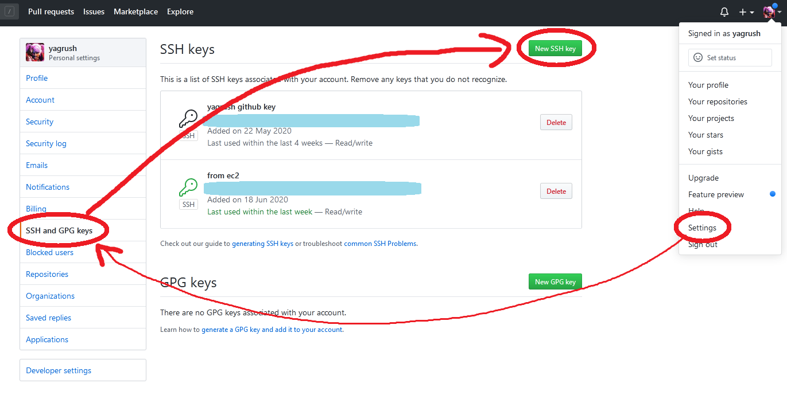
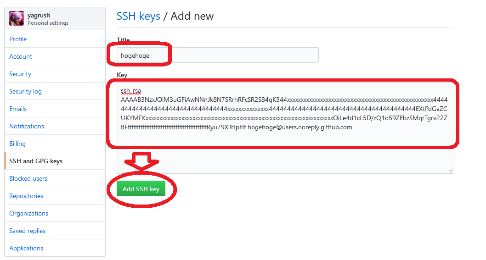

# GitHubへのSSH接続設定を、ほぼ自動で行うシェルスクリプト

※ 対話入力を途中で求められるコマンドを自動で流すことができる [expect](https://www.nist.gov/services-resources/software/expect) というライブラリを使わせて頂いてます。

## 動作環境
* AmazonLinux2 または `yum` が使えるLinux

### 他のOSは…？

※ `setup-github-ssh-step1.sh` の5行目あたり
```shell
sudo yum install -y expect git
```
の `yum` を `apt-get` に書き換えればDebian系Linuxで動いたり、
`brew` に書き換えればMacでも動くかと思います。

また 対GitHub のみならず、対GitLab などにも流用できるかと。

<br />

## 使い方

### 設定を施したいユーザーでターミナルログインする。

<br />

### 以下のコマンドで一式をダウンロード＆解凍する。

```shell
wget https://github.com/yagrush/setup-github-ssh/archive/master.zip -O setup-github-ssh.zip; unzip setup-github-ssh.zip; rm setup-github-ssh.zip

#ついでにディレクトリを移動しておく
cd setup-github-ssh-master
```

<br />

### `setup-github-ssh-setting.sh` の中身を、ご自身の設定に合わせて書き換える。

```shell
export GIT_EMAIL="hogehoge@users.noreply.github.com"
export GIT_USER="hogehoge"
```

↑ `hogehoge` を、ご自身のgithubアカウントのユーザー名に書き換えて下さい。<br />
メールアドレスは、晒しても大丈夫であれば本物のメールアドレスに書き換えて下さい。<br />
匿名アドレスにしたければ `@users.noreply.github.com` はそのままに `hogehoge` のところだけ書き換えて下さい。

<br />

### `chmod` コマンドで、３つの.shファイルに実行権限を与える。

```shell
chmod +x setup-github-ssh-*.sh
```

※すでに実行権限が付いている場合は飛ばしてOKです。

<br />

### `setup-github-ssh-step1.sh` を実行する。

```shell
./setup-github-ssh-step1.sh
```

<br />

### `setup-github-ssh-step1.sh` の実行結果にsshパブリックキーが表示されるので、GitHubのWEBページにアクセスして、GitHubアカウントに紐づけ登録する。

* sshパブリックキーの例

```shell
ssh-rsa AAAAB3NzxJOiM3uGFiAwNNnJk8N7SRrhRFcSR2S84gK544xxxxxxxxxxxxxxxxxxxxxxxxxxxxxxxxxxxxxxxxxxxxxxxxxxxxx444444444444444444444444444444444xxxxxxxxxxxxxxx4444444444444444444444444444444444444444EXtPdGaZCUKYMFKxxxxxxxxxxxxxxxxxxxxxxxxxxxxxxxxxxxxxxxxxxxxxxxxxxxxxxxxxxxxxxxxxxxxOiLe4d1cL5D/zQ1o59ZEbzSMqrTgrv22ZBFfffffffffffffffffffffffffffffffffffffffffffRyu79XJHpHf hogehoge@users.noreply.github.com
```

<br />

* sshパブリックキーを登録する画面を開く


* sshパブリックキーを登録する


<br />

### `setup-github-ssh-step2.sh` を実行する。

```shell
./setup-github-ssh-step2.sh
```

<br />

### Hi ○○○! ... などと表示されればOK！

```shell
$ ./setup-github-ssh-step2.sh
spawn ssh -T github.com
The authenticity of host 'github.com (xxx.xxx.xxx.xxx)' can't be established.
...
...
...
Warning: Permanently added 'github.com,xxx.xxx.xxx.xxx' (RSA) to the list of known hosts.
Hi hogehoge! You've successfully authenticated, but GitHub does not provide shell access.
```
